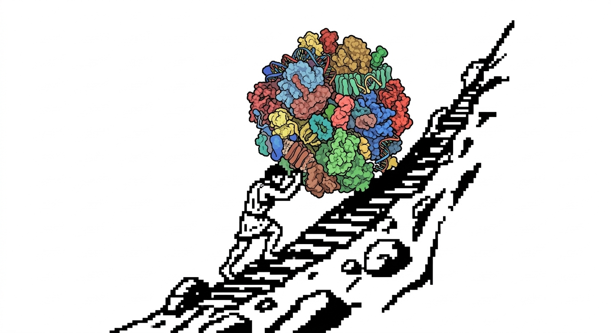

<div align="center">
  <h1>Sicifus</h1>
  
  <p>
    <strong>High-Performance Structural Biology at Scale</strong>
  </p>
  <p>
    <a href="https://arikat.github.io/sicifus"><strong>Documentation</strong></a> ·
    <a href="#installation"><strong>Installation</strong></a> ·
    <a href="#quick-start"><strong>Quick Start</strong></a>
  </p>
  <p>
    
    
    
  </p>
</div>




---

**Sicifus** is a Python library for large-scale structural biology analysis. It ingests thousands of protein structures (CIF/PDB), stores them in a fast Parquet database, and enables comparative analysis, structural alignment, phylogenetics, and physics-based mutation analysis — all on datasets larger than RAM.

## Why Sicifus?

**Problem:** Analyzing thousands of protein structures is slow and memory-intensive. Traditional tools load everything into RAM, limiting dataset size and slowing down queries.

**Solution:** Sicifus compiles structures into a **partitioned Parquet database** with lazy evaluation via Polars. This enables:

- **Out-of-core processing** — Analyze datasets larger than your RAM
- **Fast queries** — Instant filtering, aggregation, and joins on structural data
- **Structural alignment** — Sequence-independent alignment using 3Di structural alphabet
- **Mutation analysis** — ddG prediction, alanine scanning, interface mutations (OpenMM)
- **Phylogenetics** — RMSD-based trees and clustering
- **Ligand analysis** — Binding pockets, protein-ligand interactions

**Use cases:** Comparative structural biology, protein evolution studies, drug discovery, mutation effect prediction, structural genomics.

## Installation

```bash
pip install sicifus
```

For 2D ligand visualization features (requires RDKit):

```bash
pip install "sicifus[viz]"
```

## Quick Start

### 1. Ingest Data

Compile your raw structure files into the database format once.

```python
from sicifus import Sicifus

db = Sicifus(db_path="./my_db")
db.ingest("./data/cif_files", batch_size=100)
```

### 2. Structural Alignment

Align an entire dataset to a reference structure.

```python
# Align all structures to "1atp"
results = db.align_all(reference_id="1atp")
print(results.sort("rmsd").head(5))
```

### 3. Phylogenetics & Clustering

Generate a structural tree and identify clusters based on RMSD.

```python
# Generate tree and export to Newick
db.generate_tree(output_file="tree.png", newick_file="tree.nwk")

# Annotate clusters with a 2.0 Å RMSD threshold
db.annotate_clusters(distance_threshold=2.0)
print(db.cluster_summary())
```

### 4. Ligand Analysis

Analyze binding pockets and interactions.

```python
# Get residue counts in the binding pocket for all structures
pockets = db.get_binding_pockets("LIG", distance_cutoff=8.0)

# Find structures with Tryptophan in the binding pocket
import polars as pl
trp_binders = pockets.filter(pl.col("TRP") > 0)
```

### 5. Mutation & Stability

Predict the effect of point mutations on protein stability using open-source tools.

```python
from sicifus import MutationEngine

engine = MutationEngine()

# Calculate total stability
result = engine.calculate_stability("my_protein.pdb")
print(f"Total energy: {result.total_energy:.1f} kcal/mol")

# Mutate Phe-13 to Ala and get ddG
result = engine.mutate("my_protein.pdb", ["F13A"])
print(f"ddG: {result.ddg['F13A']:+.2f} kcal/mol")

# Batch mutations from a CSV
mutations_df = engine.load_mutations("mutations.csv")
results = engine.mutate_batch("my_protein.pdb", mutations_df)
print(results)
```

## Documentation

Full documentation is available at [arikat.github.io/sicifus](https://arikat.github.io/sicifus).

## License

MIT
